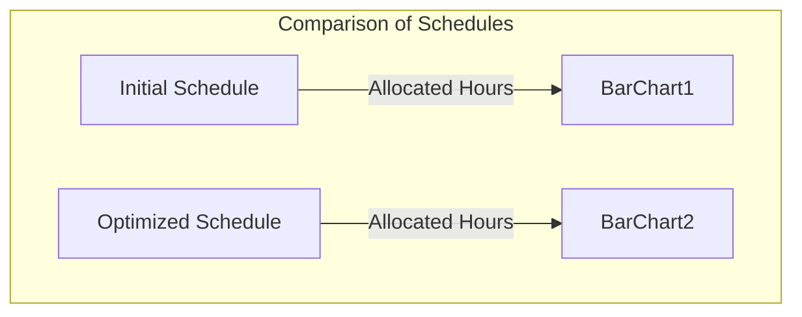
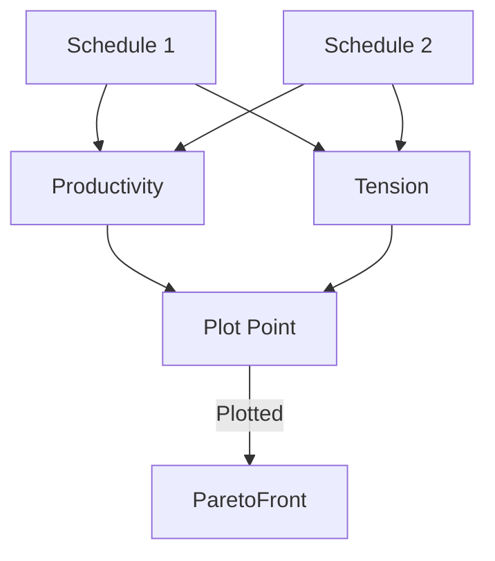

# README: Genetic Algorithm-Based Daily Schedule Optimization

## Overview
This project uses Genetic Algorithms (GA) to optimize daily schedules, balancing productivity and tension across various activities. The outcome is a schedule that maximizes productivity while maintaining a healthy work-life balance. Visualizations, including bar charts, Gantt charts, and Pareto front plots, make it easy to interpret and understand the results.

## Key Variables Explained

### Constants and Parameters
- **HOURS_IN_DAY**: `24` – Total hours in a day.
- **MIN_SLEEP_HOURS**: `7` – Minimum required hours of sleep.
- **MAX_WORK_STUDY_HOURS**: `12` – Maximum combined work and study hours.

### Activities
A comprehensive set of daily activities:
- **Work**: Professional tasks.
- **Study**: Academic work.
- **Rest/Nap**: Short breaks.
- **Sleep**: Full nighttime rest.
- **Exercise**: Physical activity.
- **Meals**: Breakfast, lunch, and dinner.
- **Leisure**: Hobbies and relaxation.
- **Socializing**: Time with friends and family.
- **Personal Care**: Grooming and hygiene.
- **Commuting**: Travel time.

### User Preferences and Weights
- **USER_PREFERENCES**: Preferences for each activity as weights summing to `1`.
- **TENSION_WEIGHTS**: Indicates the tension level for each activity.
- **PRODUCTIVITY_WEIGHTS**: Represents productivity for each activity.

### Genetic Algorithm Settings
- **NGEN**: Number of generations (`150`).
- **MU**: Size of the parent population (`300`).
- **LAMBDA**: Number of offspring generated per generation (`400`).
- **CXPB**: Crossover probability (`0.7`).
- **MUTPB**: Mutation probability (`0.2`).

## Visual Explanation with Mermaid Diagrams

### 1. Comparison of Initial and Best Schedules
This bar chart helps compare the initial and optimized schedules, showing how the GA redistributes hours to optimize the schedule.

- **X-axis**: Activities (Work, Study, Sleep, etc.)
- **Y-axis**: Hours allocated to each activity.
- **Bars**: Initial schedule (light blue) and best schedule (orange).

### 2. Gantt Charts for Initial and Best Schedules
Gantt charts illustrate the time blocks for each activity, comparing the initial and optimized schedules side by side.

```mermaid
gantt
    title Initial and Optimized Daily Schedules
    dateFormat  HH
    axisFormat  %H
    section Initial Schedule
    Work        :a1, 0, 4h
    Study       :a2, 4, 2h
    Rest/Nap    :a3, 6, 1h
    Sleep       :a4, 7, 8h
    Exercise    :a5, 15, 1h
    Meals       :a6, 16, 2h
    Leisure     :a7, 18, 3h
    Socializing :a8, 21, 2h
    section Optimized Schedule
    Work        :b1, 0, 6h
    Study       :b2, 6, 3h
    Rest/Nap    :b3, 9, 1h
    Sleep       :b4, 10, 7h
    Exercise    :b5, 17, 1h
    Meals       :b6, 18, 1h
    Leisure     :b7, 19, 2h
    Socializing :b8, 21, 1h
```

### 3. Pareto Front of Optimized Schedules
This scatter plot displays the trade-off between productivity and tension, showcasing the Pareto front for optimal schedules.

- **X-axis**: Total tension (lower is better).
- **Y-axis**: Productivity (higher is better).
- **Points**: Different solutions on the Pareto front are highlighted.

## Insights from the Visualizations
- **Balanced Life**: The constraints ensure essential activities, such as meals and sleep, are included in the schedule.
- **Flexible Framework**: Adjust weights and constraints for different lifestyle needs.
- **Customization**: Tailor the schedules for personal preferences (e.g., more leisure time, focus on work).

## How to Use the Visualizations

### 1. Compare Initial and Optimized Schedules
Use the bar chart to quickly assess how the algorithm shifts time allocations between activities.

### 2. Analyze Daily Structure with Gantt Charts
Gantt charts make it easy to see how the schedule is structured and where the improvements are made in the optimized schedule.

### 3. Evaluate Trade-offs with the Pareto Front
Use the Pareto front plot to identify the best balance between productivity and tension and understand the limitations of the optimization.

## Potential Enhancements
- **Interactive Inputs**: Allow users to adjust preferences and constraints dynamically.
- **Detailed Reporting**: Generate reports showing how the schedule was adjusted and the rationale behind each change.
- **Fixed Time Blocks**: Implement fixed time blocks for immovable activities like classes or meetings.

## Conclusion
This project offers an innovative solution for optimizing daily schedules using Genetic Algorithms. The blend of data-driven insights and visualizations makes it easy to interpret the scheduling decisions, ensuring a productive and balanced daily routine.
